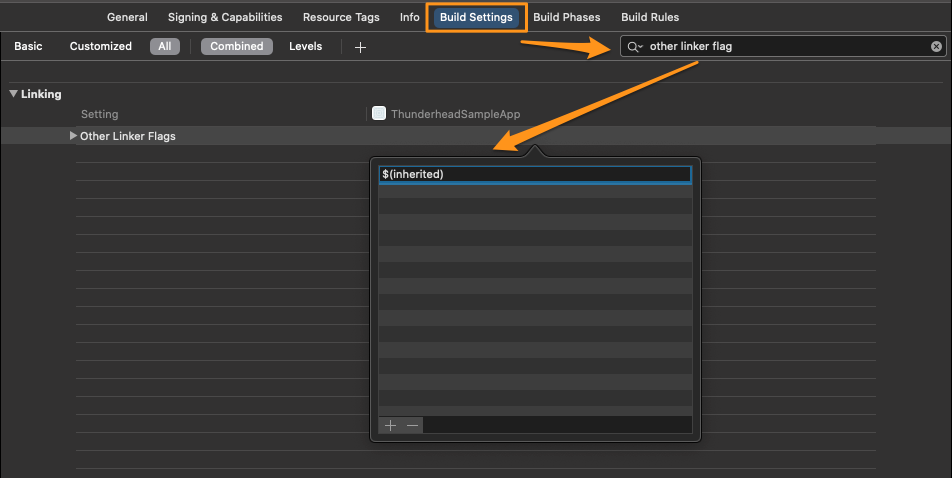
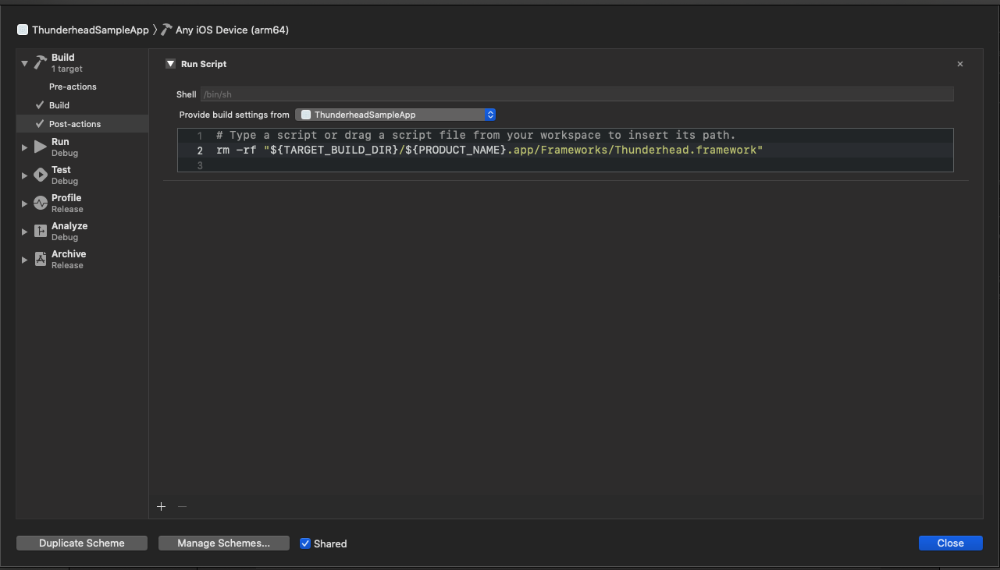

The Thunderhead SDK for iOS Troubleshooting Guide for common implementation issues.

- [Installation and archiving troubleshooting](#installation-and-archiving-troubleshooting)
  * [No such module 'Thunderhead' Xcode compile error](#no-such-module--thunderhead--xcode-compile-error)
  * [Resolve `Undefined symbols for architecture arm64` compile time error](#resolve--undefined-symbols-for-architecture-arm64--compile-time-error)
  * [Archive Error SPM - Found an unexpected Mach-O header code: 0x72613c21](#archive-error-spm---found-an-unexpected-mach-o-header-code--0x72613c21)
- [How to resolve `UITableView` layout display issues](#how-to-resolve--uitableview--layout-display-issues)
  * [Resolve `UITableView` layout issue by implementing `tableView:heightForRowAtIndexPath:`](#resolve--uitableview--layout-issue-by-implementing--tableview-heightforrowatindexpath--)
  * [Disable the in-list Optimizations feature via App's Info.plist](#disable-the-in-list-optimizations-feature-via-app-s-infoplist)
- [Deny/Block Network Connections in Xcode Simulator](#deny-block-network-connections-in-xcode-simulator)
  * [How to reduce Console connection failure messages in Xcode](#how-to-reduce-console-connection-failure-messages-in-xcode)


## Installation and archiving troubleshooting 
### No such module 'Thunderhead' Xcode compile error

When integrating the Thunderhead SDK manually into your app, you may encounter this compile error.

To resolve this, navigate to **Build Settings**, ensure the **Framework Search Paths** contains the framework filepath. If the framework is placed in your project directory, simply set the framework search path to `$(SRCROOT)` and set it to recursive.

### Resolve `Undefined symbols for architecture arm64` compile time error

When integrating the Thunderhead SDK via [CocoaPods](https://github.com/thunderheadone/one-sdk-ios#cocoapods), you may encounter this compile time error.

To resolve this error, go to app target's **Build Settings**, add `$(inherited)` to **Other Linker Flags**, which will add the linker flags generated by the Pods to your app.



### Archive Error SPM - Found an unexpected Mach-O header code: 0x72613c21

When try to upload/distribute an archive, you may encounter this error, if Thunderhead SDK was integrated via [SPM](https://github.com/thunderheadone/one-sdk-ios/#swift-package-manager).

To resolve this error, add the following **Run Script** to the scheme's **Build Post-actions**:

```sh
rm -rf "${TARGET_BUILD_DIR}/${PRODUCT_NAME}.app/Frameworks/Thunderhead.framework"
```

*Note:* 

- Make sure to select **Provide build settings** from the app.

  

- Please note this issue has already been reported to Apple's Swift Team. To track this bug [click here](https://bugs.swift.org/browse/SR-13343).

## How to resolve `UITableView` layout display issues

If you come across issues with how the layout is rendered in your `UITableView`'s, try the following:

### Resolve `UITableView` layout issue by implementing `tableView:heightForRowAtIndexPath:`
- Implement the `tableView:heightForRowAtIndexPath:` delegate method in the view controller. The method implementation is required to enable the SDK swizzling implementation to call the original implementation in all your view controllers where you are looking to display in-list Optimizations.

Swift:
```swift
func tableView(_ tableView: UITableView, heightForRowAt indexPath: IndexPath) -> CGFloat { 
     return UITableViewAutomaticDimension
}
```

Objective-C:
```objective-c
- (CGFloat)tableView:(UITableView *)tableView heightForRowAtIndexPath:(NSIndexPath *)indexPath {
    return UITableViewAutomaticDimension;
}
```

### Disable the in-list Optimizations feature via App's Info.plist
- Disable the in-list Optimizations feature by adding the following config to your app’s `Info.plist` file and set `DisableInListOptimization` to `YES` (boolean value).


```xml
<key>Thunderhead Config</key>
<dict>
	<key>Swizzling Options</key>
	<dict>
		<key>DisableInListOptimization</key>
		<true/>
	</dict>
</dict>
```	

## Deny/Block Network Connections in Xcode Simulator
### How to reduce Console connection failure messages in Xcode
For developers that use an external tool (i.e. Little Snitch) to deny/block network connections coming from the Simulator, you may find that Xcode spams the debug area console with a large amount of network log errors, like below: 

```
2020-01-20 09:33:28.281517+0100 SampleApp[27123:934708] [] nw_socket_connect [C905.1:3] connect failed (fd 13) [64: Host is down]
2020-01-20 09:33:28.281642+0100 SampleApp[27123:934708] [] nw_socket_connect connect failed [64: Host is down]
2020-01-20 09:33:28.282565+0100 SampleApp[27123:934708] Connection 2: received failure notification
2020-01-20 09:33:28.282673+0100 SampleApp[27123:934708] Connection 2: failed to connect 1:64, reason -1
2020-01-20 09:33:28.282808+0100 SampleApp[27123:934708] Connection 2: encountered error(1:64)
2020-01-20 09:33:28.286154+0100 SampleApp[27123:934708] Task <EC494682-0065-4970-A221-C23EC09C2A06>.<708> HTTP load failed, 0/0 bytes (error code: -1004 [1:64])
2020-01-20 09:33:28.286590+0100 SampleApp[27123:934657] Task <EC494682-0065-4970-A221-C23EC09C2A06>.<708> finished with error [-1004] Error Domain=NSURLErrorDomain Code=-1004 "Could not connect to server." UserInfo={NSUnderlyingError=0x600003d8b750 {Error Domain=kCFErrorDomainCFNetwork Code=-1004 "(null)" UserInfo={_kCFStreamErrorCodeKey=64, _kCFStreamErrorDomainKey=1}}, NSErrorFailingURLStringKey=https://eu2.thunderhead.com/one/oauth1/2020-01-20 09:33:28.296102+0100 SampleApp[27123:934708] [] nw_socket_connect [C906.1:3] connect failed (fd 13) [64: Host is down]
rt/api/2.0/interaction/offline?sk=SITE_KEY, NSErrorFailingURLKey=https://servername.com/one/oauth1/rt/api/2.0/interaction?sk=SITE_KEY, _kCFStreamErrorDomainKey=1, _kCFStreamErrorCodeKey=64, NSLocalizedDescription=Could not connect to server.}
2020-01-20 09:33:28.304717+0100 SampleApp[27123:934708] [] nw_socket_connect connect failed [64: Host is down]
2020-01-20 09:33:28.307448+0100 SampleApp[27123:934708] [] nw_socket_connect [C906.2:3] connect failed (fd 13) [64: Host is down]
2020-01-20 09:33:28.307579+0100 SampleApp[27123:934708] [] nw_socket_connect connect failed [64: Host is down]
2020-01-20 09:33:28.310252+0100 SampleApp[27123:934708] [] nw_socket_connect [C906.3:3] connect failed (fd 13) [64: Host is down]
2020-01-20 09:33:28.310392+0100 SampleApp[27123:934708] [] nw_socket_connect connect failed [64: Host is down]
2020-01-20 09:33:28.312445+0100 SampleApp[27123:934708] [] nw_socket_connect [C906.4:3] connect failed (fd 13) [64: Host is down]
```

These are **Apple error logs** logging *all* failed outgoing network connections configured with an external tool (i.e. Little Snitch) to block outgoing network calls in the Xcode Simulator. Below are potential solutions to help filter the Apple error logs that you see: 
- Disable the OS (Operating System) Logs by setting `OS_ACTIVITY_MODE` = `disable` in your App Scheme Configuration. 
    - See [here](https://stackoverflow.com/questions/37800790/hide-strange-unwanted-xcode-logs)
- Or, if you require to see the OS logs and only want to filter Thunderhead SDK's network calls, you can temporarily opt out an end-user from all tracking.  
	- See [here](docs/additional-features-guide.md#opt-an-end-user-outin-of-all-tracking)